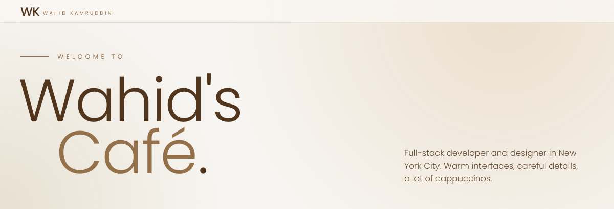

 

[**Portfolio**](https://wahidkamruddin.com) &nbsp;·&nbsp; [**Get in touch**](https://wahidkamruddin.com/contact) &nbsp;·&nbsp; [**LinkedIn**](https://www.linkedin.com/in/wahid-kamruddin/) &nbsp;·&nbsp; [**Instagram**](https://www.instagram.com/wahidkamruddin/)

 

I'm a Bangladeshi-American born and raised in NYC, with a passion for cafes, coffee, and all things design. I like making digital experiences that are beautiful and useful, and that make people's lives a little easier. When I'm not coding or designing, I'm out exploring new cafes, sipping a cappuccino, or working on my next side project.

 

<table>
  <tr>
    <td width="50%" valign="top">
      <h3><a href="https://yaply.us">Yaply</a></h3>
      
Group chat that folds event planning, tasks, budgets and shared albums into one encrypted app.

      

        
        
        
        
        
      

      <a href="https://yaply.us"><b>Explore more</b></a>
    </td>
    <td width="50%" valign="top">
      <h3><a href="https://fit-ai-closet.netlify.app">Fit</a></h3>
      
AI wardrobe that catalogs your clothes and builds outfits by mood, style and weather.

      

        
        
        
        
      

      <a href="https://fit-ai-closet.netlify.app"><b>Explore more</b></a>
    </td>
  </tr>
  <tr>
    <td width="50%" valign="top">
      <h3><a href="https://ktptc.netlify.app">KTPTC</a></h3>
      
Live queue board for Khan's Tutorial parent-teacher conference nights.

      

        
        
        
        
      

      <a href="https://ktptc.netlify.app"><b>Explore more</b></a>
    </td>
    <td width="50%" valign="top">
      <h3><a href="https://asksheikh.ai/">Sheikh AI</a></h3>
      
Ask questions, get sourced answers grounded in Islamic scholarship.

      

        
        
        
        
      

      <a href="https://asksheikh.ai/"><b>Explore more</b></a>
    </td>
  </tr>
</table>

 

**Languages** 

**Frameworks and libraries** 

**Mobile** 

**Databases and ORMs** 

**Cloud and DevOps** 

**Testing and tools** 

 

Always up for a coffee, a collaboration, or a good problem to solve.

| | |
|---|---|
| Email | [wahidkamruddin101@gmail.com](mailto:wahidkamruddin101@gmail.com) |
| LinkedIn | [wahid-kamruddin](https://www.linkedin.com/in/wahid-kamruddin/) |
| Instagram | [@wahidkamruddin](https://www.instagram.com/wahidkamruddin/) |
| Portfolio | [wahidkamruddin.com](https://wahidkamruddin.com) |

 

Brewed in New York City

